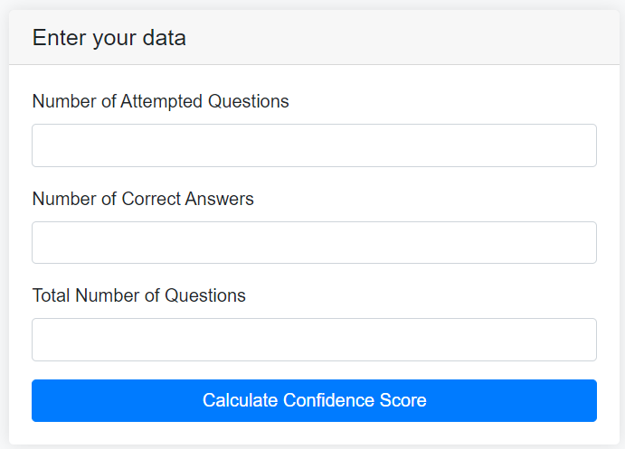
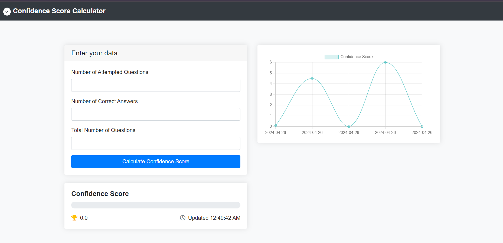

# Confidence Score Calculator

A simple web application to calculate and visualize confidence scores based on attempted and correct answers in a competitive exam.

## Table of Contents
- [Introduction](#introduction)
- [Features](#features)
- [How to Use](#how-to-use)
- [Screenshots](#screenshots)
- [Technologies Used](#technologies-used)
- [Calculation of Confidence Score](#calculation-of-confidence-score)
- [Contributing](#contributing)
- [License](#license)

## Introduction

The Confidence Score Calculator is a browser-based tool that helps users assess their confidence levels in various subjects for a competitive exam. It calculates a confidence score based on the number of attempted questions, the number of correct answers, and the total number of questions.

## Features

- Calculate confidence score based on attempted and correct answers.
- Visualize confidence score with a progress bar.
- View confidence score history with a line chart.
- Save confidence score history to local storage.

## How to Use
P.S- You can follow the below steps or visit the site [https://mr33325.github.io/ConfidenceScoreCalculator/](https://mr33325.github.io/ConfidenceScoreCalculator/)
1. Clone the repository:
   ```bash
   git clone https://github.com/mr33325/ConfidenceScoreCalculator.git
   ```

2. Open `index.html` in your web browser.

3. Enter the number of attempted questions, the number of correct answers, and the total number of questions.

4. Click the "Calculate Confidence Score" button or press Enter.

5. View your confidence score and progress bar.

6. View your confidence score history in the line chart.

## Screenshots


*Screenshot 1: Calculation Form*


*Screenshot 2: Confidence Score and Chart*

## Technologies Used

- HTML5
- CSS3 (Bootstrap for styling)
- JavaScript (Chart.js for chart visualization)

## Calculation of Confidence Score

The confidence score is calculated using the following formula:

\[ \text{Confidence Score} = \left( \frac{\text{Attempt Rate} \times \text{Accuracy Rate}}{100} \right) \times 10 \]

Where:
- Attempt Rate: Percentage of attempted questions out of total questions.
- Accuracy Rate: Percentage of correct answers out of attempted questions.

For example:
- If you attempted 30 questions out of 40 and got 24 correct answers, your Attempt Rate is \( \frac{30}{40} \times 100 = 75% \) and your Accuracy Rate is \( \frac{24}{30} \times 100 = 80% \). Hence, your confidence score would be \( \left( \frac{75 \times 80}{100} \right) \times 10 = 6 \).

## Contributing

Contributions are welcome! Fork the repository and make your changes. Submit a pull request with a clear description of your changes and why they are necessary.

## License

This project is licensed under the MIT License - see the [LICENSE](LICENSE.txt) file for details.

